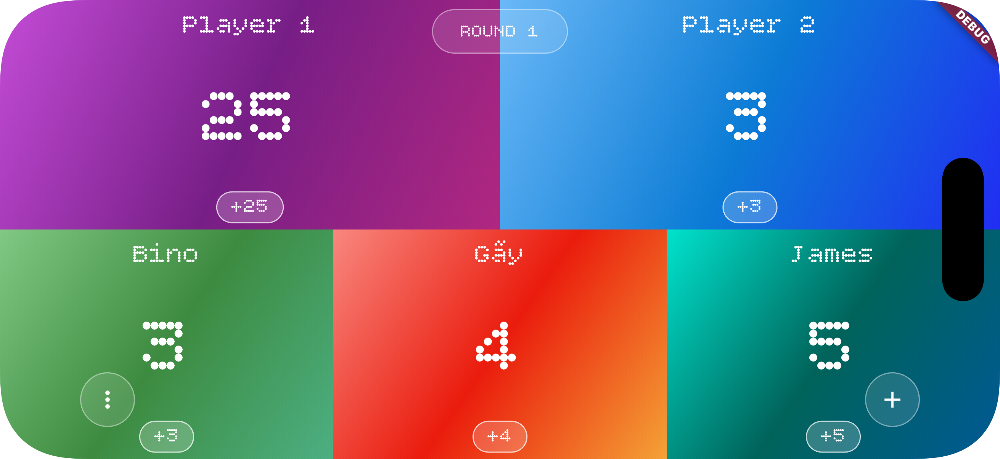
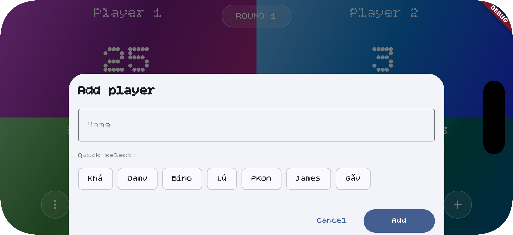
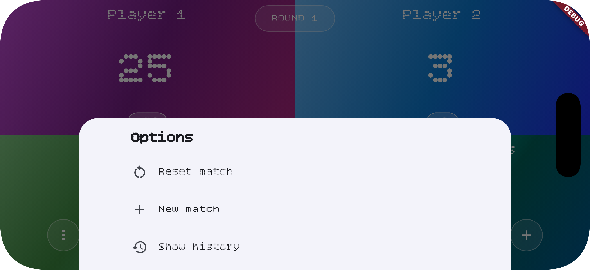
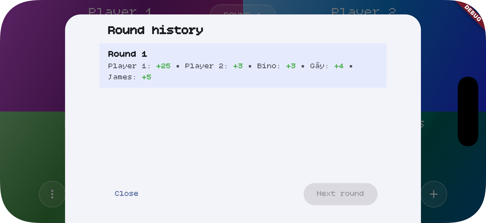
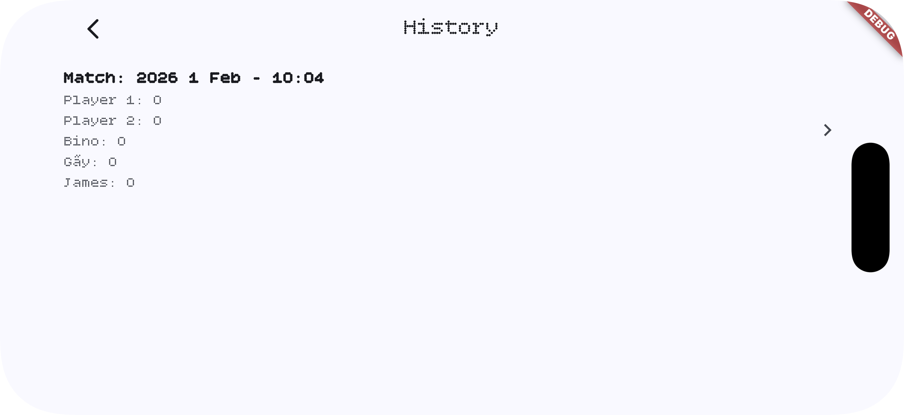

# Billiard Score Board

A Flutter app for tracking scores during billiard matches. Add players, update scores per round, and browse match history.

## Features

- **Live score board** — Main match view with player names and current scores. Tap **+** / **−** to adjust scores for the current round.
- **Add players** — Add or remove players and assign colors. Supports multiple players per match.
- **Rounds** — Scores are grouped by rounds. Start a new round to lock the previous one and keep a clear history.
- **Round history** — View and edit past round scores from the current match.
- **Match history** — Open the history screen to see all saved matches. Tap a match to load it and continue or review.
- **Options** — Reset scores, start a new round, or start a new match from the options menu.
- **Persistence** — Matches and scores are saved locally so you can resume later.

## Screenshots

### Main score board

Live match view with player columns and score controls.



### Add player

Sheet to add a new player and pick a color.



### Options

Reset scores, new round, or new match.



### Match history

List of saved matches.



### Round history

Round-by-round breakdown for the current match.



## Getting Started

### Prerequisites

- [Flutter](https://docs.flutter.dev/get-started/install) (stable channel recommended)

### Run the app

```bash
flutter pub get
flutter run
```

Supports iOS, Android, macOS, Windows, Linux, and web.

### Project structure

- `lib/` — App code (screens, widgets, cubit, models)
- `resources/` — Screenshots and assets for documentation
- `assets/fonts/` — Custom fonts (BitcountSingle, Courier Prime)

## Tech

- **Flutter** with Dart
- **flutter_bloc** for state (MatchBoardCubit)
- **intl** for date formatting
- Local persistence for matches and history

---

For Flutter docs and samples, see the [official documentation](https://docs.flutter.dev/).
